# School District Analysis

## Overview of the school district analysis

After creating an initial analysis of standardized tests for the City School District, the school board uncovered evidence of academic dishonesty for the reading and math scores for Thomas High School ninth graders. Because of this, I have been asked to replace the math and reading scores for Thomas High School ninth grader with NaNs while keeping the rest of the data intact. Based on the new results, I will show how each of the seven school district metrics were affected by this change in data.

## Results

### 1. How is the district summary affected?

Original District Summary:
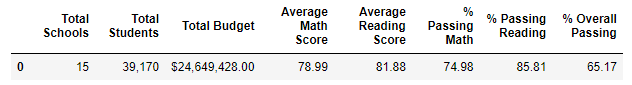

New District Summary:

Changes:
There are no significant changes from the original to the new analysis of the district summary. The total schools, students, and budget have not been affected by this change in data; However, there are minor changes in the data in the average math and reading score that result in less than .10. As well as changes in percentages of passing math, reading, and overall passing. These result in less than a 1% change in data. 

### 2. How is the school summary affected?

Original School Summary:
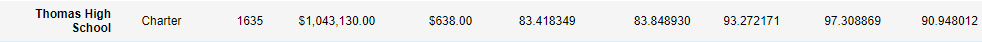

New School Summary:
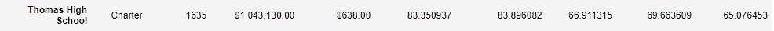

Changes:
In the new school summary we see significant changes in the math, reading, and overall passing percentages for Thomas High School. while keeping the total number of students (including 9th graders w/ NaNs), we can see a dramatic drop in their passing percentages:
    - % Passing Math: 26% drop
    - % Passing Reading: 27% drop
    - % Overall Passing: 2% drop

### 3. How does replacing the ninth graders’ math and reading scores affect Thomas High School’s performance relative to the other schools?

Original School Ranking:
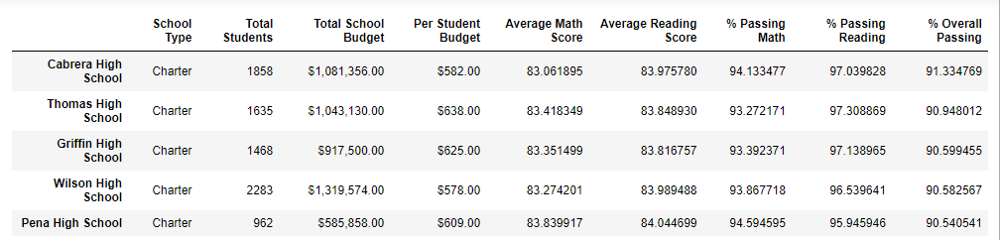

New School Ranking:
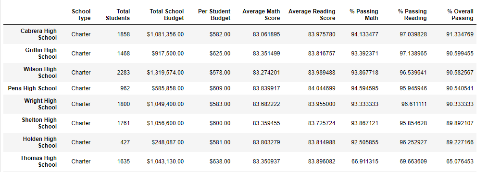

Changes: In the original analysis, Thomas High School ranked 2nd overall amongst the 15 schools. In the new analysis, Thomas High School droppd in rank from 2nd to 8th. 

### 4. How have math and reading scores by grade been affected?

Original Math Scores:
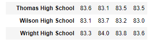

New Math Scores:
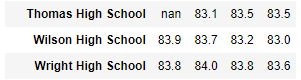

Original Reading Scores:
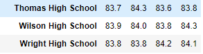

New Reading Scores:
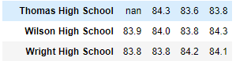

Changes:
The new math and reading scores show the change in data for Thomas High School 9th graders. Their scores have been replaced with NaN. All other data as remained intact. 

### 5: How have scores by school spending been affected?

Original Spending Summary:
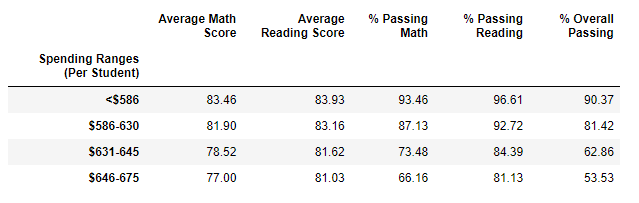

New Spending Summary:
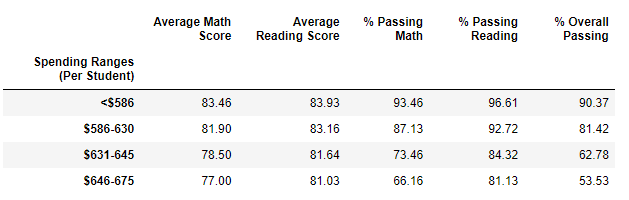

Changes:
Thomas High School falls into $631-645 spending range. The changes in scores and percentages are very minor.

### 6. How have scores by school size been affected?

Original School Size Data Frame:
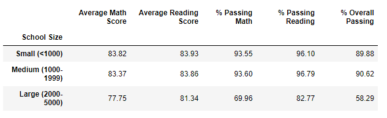

New School Size Data Frame:
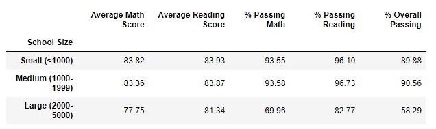

Changes:
Thomas High Schools fall into the Medium school size category. Again, there are only minor changes in score and percentages.

### 7. How have scores by school type been affected?

Original School Type Data Frame:
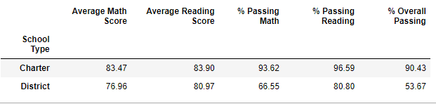

New School Type Data Frame:
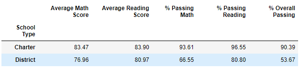

Changes:
Thomas High School is a Charter school so only the data within that row have been affected. Again, the changes are minor. 