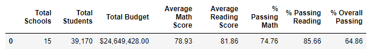

# School District Analysis

## Overview of the school district analysis

After creating an initial analysis of standardized tests for the City School District, the school board uncovered evidence of academic dishonesty for the reading and math scores for Thomas High School ninth graders. Because of this, I have been asked to replace the math and reading scores for Thomas High School ninth grader with NaNs while keeping the rest of the data intact. Based on the new results, I will show how each of the seven school district metrics were affected by this change in data.

## Results

### 1. How is the district summary affected?

    Original District Summary:

    New District Summary:

Changes:
There are no significant changes from the original to the new analysis of the district summary. The total schools, students, and budget have not been affected by this change in data; However, there are minor changes in the data in the average math and reading score that result in less than .10. As well as changes in percentages of passing math, reading, and overall passing. These result in less than a 1% change in data. 

### 2. How is the school summary affected?